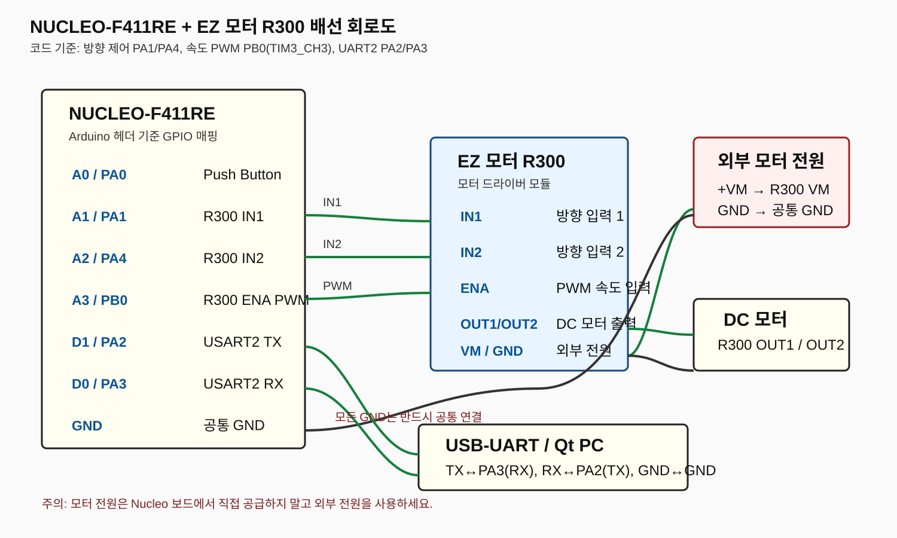

# Qt Hairdryer Motor Control

Qt Widgets application for controlling an STM32 motor through UART.

## Features

- Hairdryer-shaped Qt Widgets UI
- Motor ON/OFF control
- 0–100% motor speed slider
- Wind icon emphasis changes with motor speed
- STM32 motor state and speed feedback
- UART serial communication at 115200 baud
- STM32 source for PWM/UART motor control

## Actual operation video

[YouTube demonstration video](https://www.youtube.com/watch?v=H0aGANyIsjI)

## Hardware wiring

The project uses a **NUCLEO-F411RE** development board and an **EZ Motor R300** module.



### Pin mapping used by the STM32 code

| Function | NUCLEO-F411RE Arduino pin | STM32 GPIO | R300 connection |
|---|---|---|---|
| Push button | A0 | PA0 | Button input |
| Direction 1 | A1 | PA1 | IN1 |
| Direction 2 | A2 | PA4 | IN2 |
| Speed PWM | A3 | PB0 / TIM3_CH3 | ENA |
| Ground | GND | GND | R300 GND and motor power GND |

### ST-LINK Virtual COM connection

The PC communicates with the target STM32 through the NUCLEO-F411RE onboard **ST-LINK/V2-1**:

```
PC USB ── CN1 ST-LINK USB
             │
             └── onboard ST-LINK VCP ── USART2
                                      ├── PA2 / D1 = TX
                                      └── PA3 / D0 = RX
```

No separate USB-UART adapter is required. Use a USB data cable and select the ST-LINK Virtual COM Port in Qt or Tera Term. The firmware uses 115200 baud, 8 data bits, no parity, and 1 stop bit.

For the default NUCLEO-F411RE VCP routing, keep **SB13/SB14 ON** and **SB62/SB63 OFF**. The exact solder-bridge configuration can vary if the board has been modified.

Connect the R300 motor output to the DC motor. Supply the motor from an external power source appropriate for the motor and connect the motor-power ground to the Nucleo GND. Do not power the motor directly from the Nucleo board.

> The diagram follows the GPIO assignments in `stm32/main.c`. Confirm the exact R300 terminal labels and motor supply voltage printed on the module before wiring.

## Qt build

Open `qt/MotorControl.pro` with Qt Creator.

Required Qt modules:

- Qt Widgets
- Qt SerialPort
- C++17

The project currently creates the UI in C++ code, so no separate `.ui` file is required.

## UART commands

Qt sends newline-terminated commands:

```
ON
OFF
SPEED:0
SPEED:50
SPEED:100
FORWARD
REVERSE
STATUS
```

STM32 returns messages such as:

```
MOTOR:ON
MOTOR:OFF
DIR:FORWARD
DIR:REVERSE
SPEED:50
BUTTON:PRESS
```

## Source folders

- `qt/` — Qt Widgets UI and UART communication
- `stm32/` — STM32 GPIO, PWM, UART, button, and motor-control code
